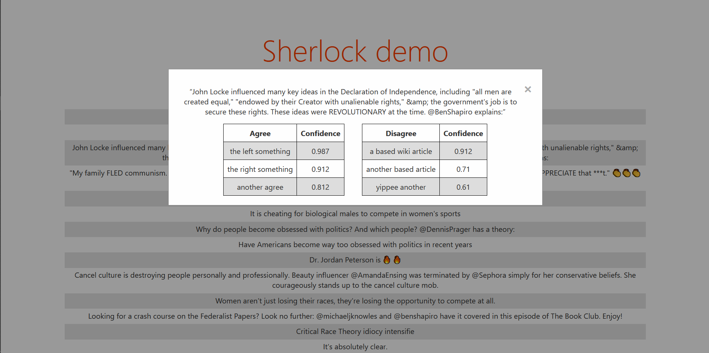

# sherlock
Automatic fake news detection using machine learning. 

The goal of this repository is to provide a accurate and reliable method for spotting fake news 
that has been already debunked by fact-checking websites such as Politifact. It does this by 
comparing sentences from the text that needs fact-checking with scraped fact check results from
APIs such as Google's Fact Check Explorer(https://toolbox.google.com/factcheck/explorer), and 
returns fact check results with a similarity score over a certain threshold. 

# Usage

To get the dataset, run

```
make dataset -j4
```

To use a different downloading binary such as ``aria2``, set the download variable with

```
make dataset -j4 download="aria2c -x 8"
```

## Demo



To use the demo, run

```
make
python3 -m pip install -r requirements.txt
python3 -m uvicorn sherlock.demos.app:app
```

Prerequisites for the demo:
  * python >= 3.8
  * npm
